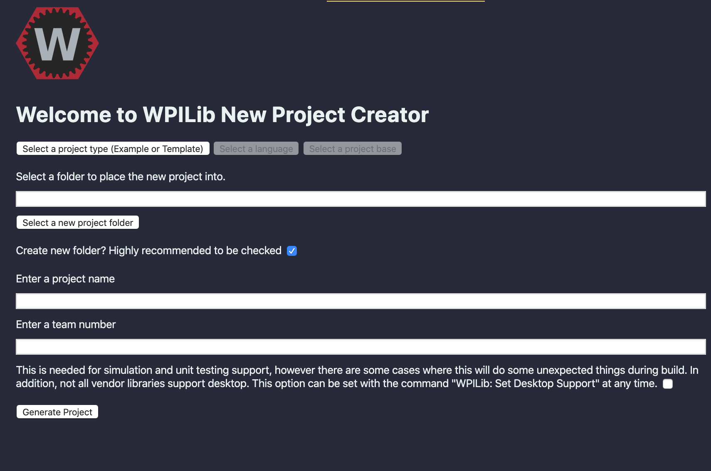
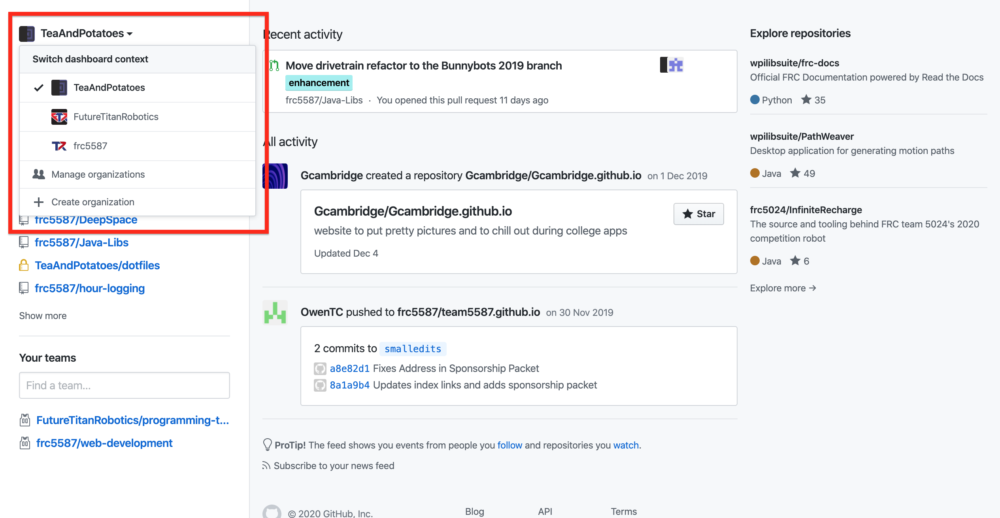
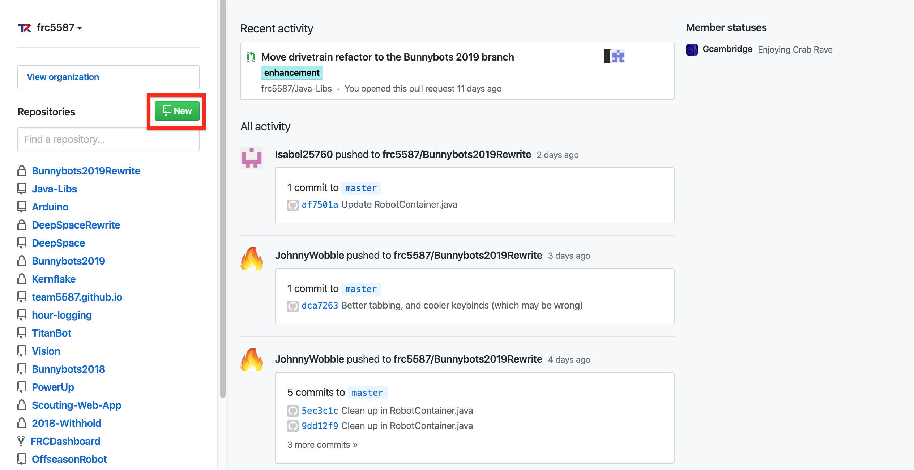
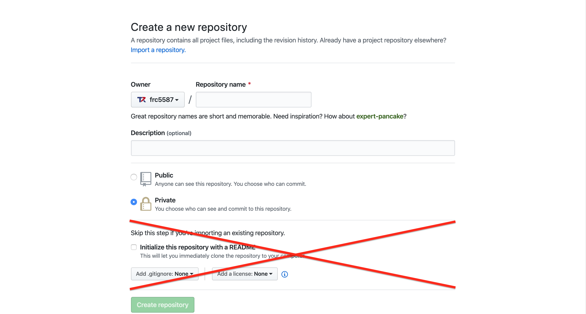
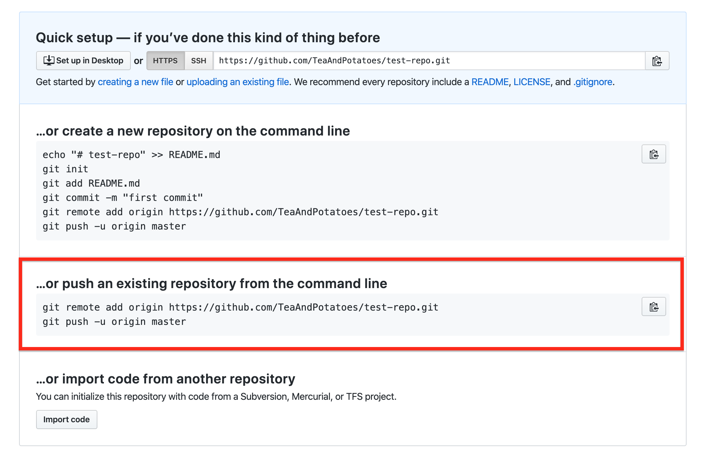

# Creating a Project

Creating a new project for robot code can be a little weird, especially because of the library files that carry over as a git submodule. Thus, the following guide is broken down into three parts:

1. Creating the template project
2. Setting up git and GitHub for the new project
3. Adding our libraries as a git submodule

## Prerequisites

- Install VSCode and the WPILib extension either through [WPILib's all-in-one installer](https://docs.wpilib.org/en/latest/docs/getting-started/getting-started-frc-control-system/wpilib-setup.html) or separately
- [Install git](https://git-scm.com/book/en/v2/Getting-Started-Installing-Git)
- Sign up for GitHub and be a part of the team's GitHub organisation

## Creating the template project

From inside a VSCode window,

1. Click the WPILib icon in the top right of the VSCode window
2. Find and click the "Create a new project" option and a new tab in VSCode will open: 
3. Click the button that says "Select a project type (Example or Template)"
4. Select "Template", then "Java", then "Command Robot"
5. Click the "Select a new project folder" button and in the dialogue that pops up, navigate to the folder you wish your new project to be generated in, then click "Select Folder"
  
   Note that the project will be generated in a new folder inside the folder you create. So if you want your project to end up in `C:\Documents\My New Project\`, navigate to `C:\Documents\`

6. Enter a name in the "Enter a project name" text field, which will determine the name of the folder your new project goes in

   So if you selected `C:\Documents\` in step five and name your project "Hello World", the code will end up in `C:\Documents\Hello World\`

7. Enter "5587" in the "Enter a team number" text field
8. Click the "Generate Project" button
9. Choose either "Yes (New Window)" or "Yes (Current Window)" in the dialogue that pops up to open your new project

## Setting up git and GitHub for the new project

Now that the project is set up locally on your computer, we have to set up git to track local changes, GitHub to provide a remote place to store those changes, and then connect the two.

### Initialising git in the project

From a VSCode window open to your new project (if continuing from the previous part, this is what you just did)...

1. Open up the VSCode integrated terminal ("Ctrl+\`" or "Cmd+\`" by default)
2. Type the following into the terminal

```bash
git init
```

### Creating a remote GitHub repository

1. Switch to the `frc5587` GitHub account

2. Click the "New" button to start creating a new repository where your previously generated project will end up

3. Enter a repository name, optional description, and set whether the repository will be publicly visible or private to our team (you'll probably want the latter) on the page that pops up. However, **don't Initialize the repository with a README, add a `.gitignore`, or add a license** because you're importing code that already exists


### Connecting the local git project and GitHub

1. Use the VSCode integrated terminal to execute the lines in the "...or push an existing repository from the command line" section


## Adding our libraries as a git submodule

1. Make the folder for the lib either in the VSCode integrated terminal for the project with the command

```bash
mkdir -p src/main/java/org/frc5587/
```

or by manually created each folder until the path `src/main/java/org/frc5587/` can be viewed in the VSCode sidebar

2. Run the following line to add the submodule:

```bash
git submodule add https://github.com/frc5587/Java-Libs.git src/main/java/org/frc5587/lib
```

You're finally done!

## Further Resources

1. [Creating a robot program guide](https://docs.wpilib.org/en/latest/docs/software/wpilib-overview/creating-robot-program.html)
2. [Full git submodule guide](https://git-scm.com/book/en/v2/Git-Tools-Submodules)
3. [Quick git submodule reference](https://gist.github.com/Noitidart/7af2e120bb83e2be9aa4cc3ca0a37722)
